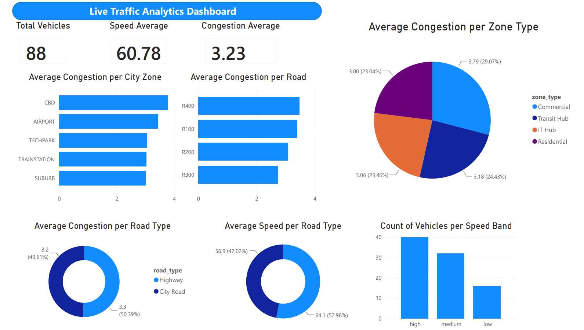
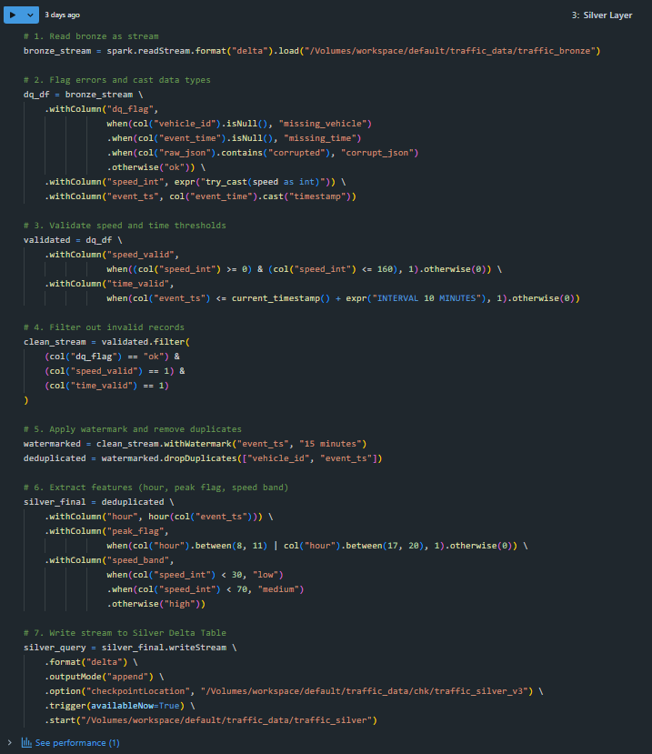
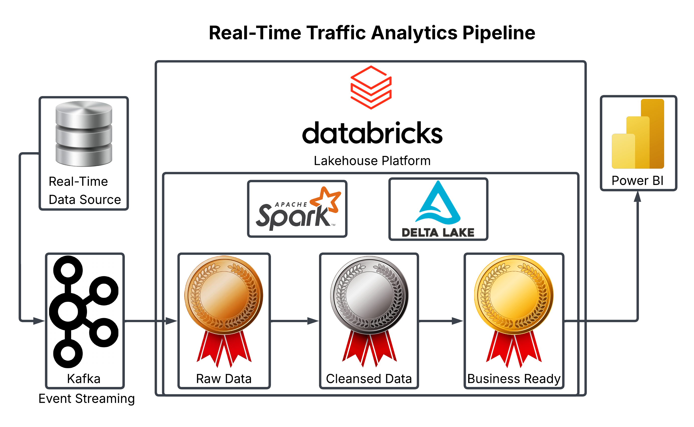

# Real-Time Traffic Analytics Pipeline

## Project Overview
This repository contains the architecture and source code for a distributed real-time data pipeline engineered to process traffic telemetry and clickstream data. The system is designed to ingest high-velocity data via a local message broker, process the streams using Apache Spark, and enforce data quality within a Delta Lake Medallion architecture for downstream analytics.

 

## Architecture & Technology Stack
*   **Containerization:** Docker Desktop
*   **Event Streaming:** Apache Kafka
*   **Stream Processing:** PySpark Structured Streaming (Databricks)
*   **Storage Layer:** Delta Lake (Bronze, Silver, Gold Architecture)
*   **Analytics & Visualization:** Power BI

## Pipeline Workflow & Engineering Responsibilities
The project was executed through a distributed development approach, dividing the pipeline into two primary engineering phases:

### Phase 1: Infrastructure & Ingestion
*   **Local Environment Setup:** Configured and deployed a containerized Apache Kafka cluster utilizing Docker Desktop.
*   **Data Streaming:** Developed a producer mechanism to simulate and transmit high-throughput traffic telemetry data.
*   **Bronze Layer Implementation:** Handled the initial ingestion process, consuming raw JSON events from Kafka topics and writing them continuously to the Delta Lake Bronze layer to establish an immutable historical record.

### Phase 2: Stream Processing & Analytics (Engineered by Yousef Mohamed Mahmoud)
*   **Silver Layer (Cleansed & Conformed):** 
    *   Enforced schemas and executed data type casting on the streaming data.
    *   Applied data quality rules to filter corrupt JSON payloads and validate numerical thresholds (e.g., speed and timestamp bounds).
    *   Implemented event-time watermarking and deduplication logic to systematically handle late-arriving records.

*   **Gold Layer (Business Ready):** Aggregated the cleansed streams to compute traffic-specific Key Performance Indicators (KPIs) and optimized the Delta tables for read-heavy operations.
*   **Serving & Visualization:** Established a direct connection via Databricks SQL endpoint to Power BI, developing an interactive dashboard to visualize real-time traffic metrics.

## Data Evolution (Medallion Architecture Samples)
To logically illustrate the data transformation process, below are representative data schemas and samples at each stage of the pipeline extracted directly from the processing layers:

### 1. Bronze Layer (Raw Data)
*Immutable append-only storage containing the raw JSON payloads exactly as received from the Kafka message broker.*

| kafka_timestamp | vehicle_id | raw_json |
| :--- | :--- | :--- |
| 2026-06-27 17:53:19.399 | e316d4fe-e800-44a7-81ec-245d6bfb62ff | `{"vehicle_id": "e316d4fe-e800-44a7-81ec-245d6bfb62ff", "road_id": "R400", "city_zone": "TECHPARK", "speed": 24, "congestion_level": 3, "weather": "FOG", "event_time": "2026-06-27T17:53:19.399486+00:00", "road_condition": "UNDER_CONSTRUCTION"}` |
| 2026-06-27 17:53:39.966 | 4879af14-a258-4374-a037-391e867900a1 | `{"vehicle_id": "4879af14-a258-4374-a037-391e867900a1", "road_id": "R300", "city_zone": "TECHPARK", "speed": 89, "congestion_level": 5, "weather": "STORM", "event_time": "2026-06-27T17:53:39.966545+00:00"}` |

### 2. Silver Layer (Cleansed & Conformed)
*Parsed, typed, and validated records. Invalid entries are handled via DQ flags or filtered entirely.*

| vehicle_id | speed_int | event_ts | speed_band | dq_flag | time_valid |
| :--- | :--- | :--- | :--- | :--- | :--- |
| e316d4fe-e800-44a7-81ec-245d6bfb62ff | 24 | 2026-06-27T17:53:19.399Z | low | ok | 1 |
| 8ec6394b-9069-4584-b977-65d67e0272c2 | 51 | 2026-06-27T17:53:48.403Z | medium | ok | 1 |
| a4508916-c8a4-40f7-8a93-b0a711eb0c27 | 73 | 2026-06-27T17:53:08.255Z | high | ok | 1 |

### 3. Gold Layer (Star Schema for Power BI)
*Business-level aggregations and materialized views structured in a Star Schema, optimized for direct querying by the Power BI dashboard.*

**fact_traffic (Fact Table):**
| vehicle_id | road_id | city_zone | speed_int | congestion_level | event_ts | peak_flag | speed_band | weather |
| :--- | :--- | :--- | :--- | :--- | :--- | :--- | :--- | :--- |
| e316d4fe-e800-44a7-81ec-245d6bfb62ff | R400 | TECHPARK | 24 | 3 | 2026-06-27 17:53:19.399 | 1 | low | FOG |
| 8ec6394b-9069-4584-b977-65d67e0272c2 | R200 | TECHPARK | 51 | 5 | 2026-06-27 17:53:48.403 | 1 | medium | STORM |
| a4508916-c8a4-40f7-8a93-b0a711eb0c27 | R200 | TRAINSTATION | 73 | 4 | 2026-06-27 17:53:08.255 | 1 | high | RAIN |

**dim_zone (Dimension Table):**
| city_zone | zone_type | traffic_risk |
| :--- | :--- | :--- |
| TRAINSTATION | Transit Hub | High |
| AIRPORT | Transit Hub | High |
| SUBURB | Residential | Low |

**dim_road (Dimension Table):**
| road_id | road_type | speed_limit |
| :--- | :--- | :--- |
| R400 | City Road | 60 |
| R300 | City Road | 60 |
| R100 | Highway | 100 |

## Technical Implementations & Optimizations
*   **Exactly-Once Semantics:** Configured Spark checkpointing and watermark thresholds to prevent data duplication and ensure idempotent writes during micro-batch processing.
*   **Storage Optimization:** Executed automated Delta Lake `OPTIMIZE` and `Z-ORDER` operations to compact small Parquet files generated by continuous streaming, preventing read performance degradation in the BI layer.

## Contributors
*   **Mohamed Amin:** Data Engineer (Infrastructure, Kafka, Bronze Layer)
*   **Yousef Mohamed Mahmoud:** Data Engineer (PySpark, Silver/Gold Layers, Analytics)
